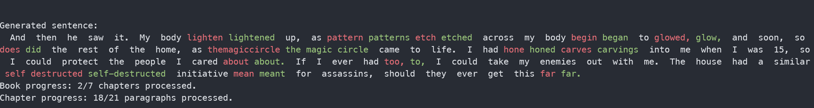

# EpubAutoEditor

EpubAutoEditor is a tool designed for automatically processing EPUB files, providing grammar correction, and enabling bulk editing of entire EPUB collections with LLM. <br>
It is designed to integrate with my custom gguf agent [gguf-py-backend](https://github.com/pisichi/gguf-py-backend). Or you can use with any Llama.cpp supported model.





## Requirements

- Python 3.x
- Dependencies (Install using `pip install -r requirements.txt`)


For a detailed installation guide of Llama-Cpp-Python with Nvidia gpu acceleration, you can follow this tutorial on Medium: [Installing Llama-Cpp-Python with NVIDIA GPU Acceleration on Windows: A Short Guide](https://medium.com/@piyushbatra1999/installing-llama-cpp-python-with-nvidia-gpu-acceleration-on-windows-a-short-guide-0dfac475002d)


## Usage

1. Clone or download this repository.
3. Run the script: `python epub.py`


## Env

   ```env
   ### program settings ###
   # Input and output folders
   INPUT_FOLDER = "input"
   OUTPUT_FOLDER = "output"
   # Cache and verbosity settings
   NO_CACHE = False
   VERBOSE = False
   # your agent URL
   LLAMA_URL = http://example.llm-agent-url:8083/generate
   
   #### llama.cpp model settings, wil be ignored if MODEL_PATH is not provided ####
   MODEL_PATH = model/example_model.gguf  # If this has a value, the URL will be ignored
   N_GPU_LAYERS = -1
   N_CTX = 2048
   N_BATCH = 32
   # Editor's prompt and message formatting
   AGENT_PROMPT = "You are a professional editor. Your job is to fix grammar in the given paragraph to enhance its quality."
   PREDEFINED_MESSAGES_FORMATTER_TYPE = "CHATML"
   # Debugging option
   DEBUG_MODEL_OUTPUT = False
   ```


### Command-line Arguments
All args is optional, it'll has higher priority than env if provided.

- `-i, --input`: Input folder containing EPUB files (default: `input`).
- `-o, --output`: Output folder for processed EPUB files (default: `output`).
- `--url`: URL of the Llama agent (default: `http://localhost:8083/generate`).
- `--no-cache`: Disable caching (default is false).
- `--verbose`: Enable verbose logging.
- `--model-path`: Path to model file.


#### Example 1: Provide custom input and output folders
```bash
python epub.py -i custom_input_folder -o custom_output_folder
```

#### Example 2: Use a custom Llama agent URL
```bash
python epub.py --url http://custom.llama-agent-url:8083/generate
```

#### Example 3: Use Llama model locally
```bash
python epub.py --model-path "./model/example_model.gguf"
```

#### Example 4: Disable caching explicitly
```bash
python epub.py --no-cache
```

#### Example 5: Enable verbose logging
```bash
python epub.py --verbose
```

## Example Request (if use url)
```bash
curl --location 'http://127.0.0.1:8083/generate' \
--header 'Content-Type: application/json' \
--data '{"input_text": "Hey, what can you do?", "max_tokens": -1}'
```

